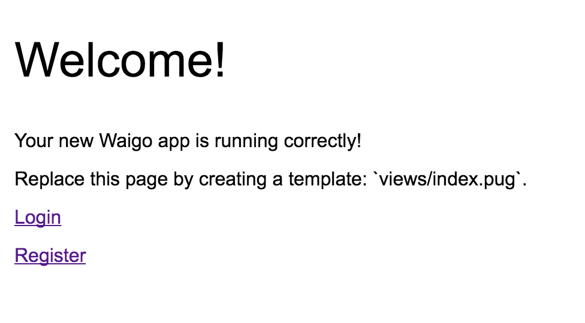

# Running "Hello World"

I am going to assume you [installed](Installation.md) Waigo as a global NPM module, and that the `waigo` command-line executable is thus available in your shell `PATH`.

Create a folder which will hold your Waigo app and then open up a command-line shell/terminal into it. 

For the purposes of this example I will assume your folder is located at `/dev/myapp` and that you have `cd`-ed into it. First let's create a `package.json` file:

```shell
$ npm init
```

Now we are ready to setup a skeleton Waigo app:

```shell
$ waigo init

[waigo-cli] NPM install waigo semver
... 
[waigo-cli] Creating: start-app.js
[waigo-cli] Creating: src/config/base.js
```

You can start Waigo using:

```shell
$ ./start-app.js
```

You will see lots of log output from Waigo, and then a line which looks like this:

```shell
...
(RamMacbookPro.local-11267) [2016-06-11 21:38:05.993] [INFO] [app] - Startup complete
```

Now navigate to `http://localhost:3000` in your browser and you should see something similar to:

